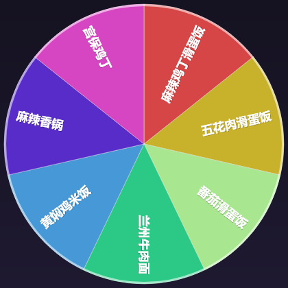

# 吃啥转盘 · What To Eat Wheel

> 一个转盘，转到哪道就吃哪道。给「今天中午吃啥」这个世纪难题一个物理答案。

自己往里加菜（打字 / 拍照识别食堂菜牌），按**大类**和**小项**挑今天想吃的范围，
然后点一下中间的「转」——转盘随机停在一道菜上，去买饭就行。

<p align="center">
  
</p>

<p align="center">
  
  
</p>

---

## 它解决什么问题

站在食堂门口，明明有几十个窗口，却想不起来自己想吃啥。
市面上「随机吃什么」的小工具大多只能给你一句文字结果，而且得先把菜一道道敲进去。

这个项目针对的正是**学校食堂**这个场景：

- **菜名不齐**——拍一张菜牌照片，自动认出上面写了哪些菜。
- **菜品成系列**——「麻辣鸡丁滑蛋饭 / 五花肉滑蛋饭 / 番茄滑蛋饭」其实是同一个大类，
  菜单里按大类折叠，勾大类就是把这一系列全放上转盘，只勾一道就是只转那一口。
- **要的是决定，不是列表**——结果用一个真的会转的转盘给出来。

---

## 功能

| 功能 | 说明 |
|---|---|
| 🎡 **转盘随机** | Canvas 手绘转盘，缓动减速动画、指针落在哪道就是哪道、中奖扇区高亮、可选音效与撒花 |
| ✍️ **手动添加** | 打字回车就加；支持粘贴多行（一行一个）、顿号/逗号一次写多道；自动去重 |
| 📷 **拍照识别** | 拍食堂菜牌 → 视觉大模型识别菜名 → 逐条确认/改名/选大类 → 一键入库 |
| 🗂 **大类 / 小项** | 菜名带相同后缀自动归成大类；大类可折叠、可重命名、可与另一个大类合并 |
| ✨ **智能归类** | 一键按菜名后缀重新分大类（「红烧牛肉面 + 兰州牛肉面」→ 自动建「牛肉面」） |
| ✅ **灵活勾选** | 大类级全选/半选、单道勾选、全选/全不选/反选、「只转这一道」 |
| 💾 **离线优先** | 单文件网页，双击即用；数据只存在本机 localStorage，导出/导入 JSON 备份 |
| 📱 **手机 App** | 提供 Capacitor 安卓工程，可打包 APK；原生网络请求不受浏览器跨域限制 |
| 🌗 **深色 / 浅色** | 跟随系统或手动切换 |

---

## 快速开始

### 1. 直接用（零安装）

下载仓库里的 **`dist/吃啥转盘.html`**，用浏览器打开就行。
它把 CSS 和 JS 全部内联在一个文件里，不联网也能用（拍照识别那一步除外）。

手机上打开后，建议「添加到主屏幕」，之后就跟 App 一样一键全屏启动。

### 2. 本地服务器（推荐，拍照识别不跨域）

```bash
npm run serve          # 会先构建再起服务，默认 http://127.0.0.1:5178
```

用这种方式打开页面时，把设置里的「通过本地代理请求」勾上，
识别请求会经本地服务器转发，**彻底避开浏览器 CORS 限制**，
而且终端会打印局域网地址，手机连同一个 WiFi 就能用。

### 3. 安卓 APK

仓库的 [Releases](../../releases) 页有打包好的 APK，直接下载安装即可
（首次安装需要允许「安装未知来源应用」）。包名 `com.mengxiangbaofu.whattoeatwheel`，
minSdk 24（Android 7.0+），自签名。

> Release 里的资源名是英文的（`what-to-eat-wheel-v1.0.0-debug.apk`）——
> GitHub 的 Release 资源名只支持 ASCII，中文会被它悄悄改掉。

自己从源码打包：

```bash
npm install
npx cap add android          # 只在第一次需要，生成 android/ 工程
npm run setup:android        # 把 Gradle 缓存和 debug 签名复制进仓库（见下方说明）
npm run apk                  # 打 debug 包，产物在 release/ 和 android/app/build/outputs/apk/debug/
npm run apk:release          # 正式包（需要自己配签名）
```

APK 已内置 `CapacitorHttp`，识别请求走原生网络栈，不受跨域限制。

> **`npm run setup:android` 是干什么的**
> Gradle 默认把缓存放在 `~/.gradle`、debug 签名放在 `~/.android`，都在仓库之外。
> 在没有系统盘写权限的环境里（或者沙箱只允许写工作区），Gradle 连 wrapper 的锁文件都建不出来，
> 会直接报「拒绝访问」。这个脚本把已有缓存复制进仓库的 `.gradle-home/`（约 1 GB，已 gitignore），
> 好处是省掉「从 Google Maven 重新下载全部依赖」——国内网络下那一步基本不可能成功。
> 如果你的环境本来就能写 `~/.gradle`，跳过这一步也行。

---

## 拍照识别怎么配

识别走的是**任何 OpenAI 兼容的 `/chat/completions` 接口**，图片以 base64 内联发送。
在「⚙️ 设置」里选服务商、填 API Key，点「测试连接」即可。

内置预设（模型名以各家控制台为准，可随时手改）：

| 服务商 | base URL | 预置模型 | 备注 |
|---|---|---|---|
| **智谱 AI**（默认） | `https://open.bigmodel.cn/api/paas/v4` | `glm-4.6v-flash` | 有**免费**视觉模型，学生党首选 |
| 硅基流动 | `https://api.siliconflow.cn/v1` | `Qwen/Qwen3.5-4B` | 有免费视觉模型 |
| 阿里云百炼 | `https://dashscope.aliyuncs.com/compatible-mode/v1` | `qwen3-vl-plus` | 新用户每模型送 100 万 token |
| 火山方舟豆包 | `https://ark.cn-beijing.volces.com/api/v3` | `doubao-seed-1-6-vision-250815` | 模型名可能要填接入点 ID |
| 月之暗面 Kimi | `https://api.moonshot.cn/v1` | `kimi-k3` | 只接受 base64 图片（本应用正好是） |
| Google Gemini | `https://generativelanguage.googleapis.com/v1beta/openai` | `gemini-3.8-flash` | 有免费层，国内一般需中转 |
| OpenAI | `https://api.openai.com/v1` | `gpt-5.2` | 无免费额度 |

> 浏览器直接调第三方接口会受 **CORS** 限制，各家的支持情况不一样且会变。
> 所以：**网页版建议用 `npm run serve` + 勾选「通过本地代理请求」**；
> **APK 版不受影响**。没配 Key 也不影响手动加菜和转盘。

---

## 大类是怎么自动分出来的

中餐菜名基本是「前缀 + 品类词」的结构，所以按**共同后缀**聚类就够用了：

```
麻辣鸡丁【滑蛋饭】
五花肉  【滑蛋饭】     → 自动生成大类「滑蛋饭」
番茄    【滑蛋饭】
```

规则（`src/js/classify.js`）：

1. 菜名里已经包含某个大类名 → 直接归入（取最长匹配）。
2. 否则统计所有菜名的共同后缀，**长后缀优先**；后缀要至少 3 个字，
   并且要么以「饭/面/粉/汤/锅…」这类品类词结尾，要么被 3 道以上菜名共享。
3. 加新菜时会即时提示：加「黑椒鸡排滑蛋饭」时，发现和已有的「麻辣鸡丁滑蛋饭」
   共享后缀「滑蛋饭」，就自动建好大类并把两道菜一起放进去。

这样设计是为了避免「肉面」「蛋饭」这种没意义的怪大类，也避免两道不相干的菜被硬凑在一起。
分得不满意随时可以手动改——毕竟最终是你要去吃。

---

## 目录结构

```
what-to-eat-wheel-20261005/
├── src/                      源码
│   ├── index.html            页面骨架（含 INLINE 占位注释）
│   ├── styles.css            样式
│   └── js/
│       ├── util.js           工具函数、本地存储、图片压缩
│       ├── store.js          数据模型与持久化、服务商预设
│       ├── classify.js       智能归类（纯函数，可单测）
│       ├── wheel.js          Canvas 转盘绘制与旋转动画、音效
│       ├── vision.js         视觉模型调用与结果解析
│       ├── ui.js             弹窗 / 表单 / 提示 / 撒花
│       └── app.js            主程序，把上面这些串起来
├── scripts/
│   ├── build.mjs             把 src 打包成单文件 HTML
│   ├── serve.mjs             本地服务器 + /api/vision 代理
│   ├── build-apk.mjs         一键打 APK
│   ├── setup-android.mjs     把 Gradle 缓存 / debug 签名复制进仓库
│   ├── publish-github.mjs    用 GitHub API 建仓、提交、发 Release（替代 git push）
│   ├── gen-icons.mjs         生成图标与启动图
│   ├── render-wheel.mjs      把转盘渲染成 PNG（用于检查视觉效果）
│   ├── test-classify.mjs     智能归类自测（纯 Node）
│   └── smoke-test.mjs        jsdom 全流程冒烟测试
├── dist/                     构建产物（已提交，可直接下载使用）
│   ├── index.html
│   └── 吃啥转盘.html
├── release/                  打包出来的 APK（gitignore，走 Releases 分发）
├── android/                  Capacitor 安卓工程
├── docs/
│   ├── 使用说明.md            面向使用者的说明
│   └── screenshots/
└── capacitor.config.json
```

---

## 开发

```bash
npm install
npm run build      # 构建单文件网页到 dist/
npm test           # 构建 + 智能归类自测（8 项）+ jsdom 全流程冒烟测试（23 项）
npm run serve      # 本地服务器
npm run apk        # 打 APK
npm run render:wheel   # 导出转盘 PNG，肉眼检查扇区/字号
npm run icons      # 重新生成安卓图标与启动图
```

### 发布到 GitHub

```bash
$env:GH_TOKEN = "ghp_xxx"      # 需要 repo 权限
npm run publish:github         # 建仓 + 提交 + 发 Release（带 APK）
```

`scripts/publish-github.mjs` 走的是 GitHub REST API 而不是 `git push`：
有些网络环境里 `github.com`（git 用的域名）连不上，但 `api.github.com` 是通的。
脚本会逐文件上传 blob、组装 tree 和 commit、最后把分支指过去，
并且会比对远端 commit 的 SHA 和本地 HEAD——**一致才说明两边真的完全相同**（blob/tree/commit
的哈希只由内容决定，所以只要作者、时间、提交信息一字不差，SHA 就会一样）。

### 几处刻意的设计

- **不用打包器**：应用总共 100 多 KB、零第三方运行时依赖，`scripts/build.mjs`
  只做一件事——把 CSS/JS 内联进 HTML，产出一个可以直接发给别人的 `.html`。
  （顺带提醒：`String.replace` 的替换串里 `$$` 会被当成转义序列，所以构建脚本用的是函数式替换。）
- **不用 ES Module**：`file://` 下浏览器会因为 CORS 拒绝加载 module script，
  所以源码用 IIFE 挂到 `window.W` 上——这样单文件双击打开也能跑。
- **拿不准的逻辑写自测**：智能归类是纯函数，用 Node 直接跑；界面用 jsdom 跑一遍，
  能抓到「`<input>` 吃掉换行导致粘贴多行失效」这类只有真跑起来才暴露的问题。

### 打包 APK 的环境要求

需要 **JDK 21** 和 **Android SDK（platform 36 + build-tools）**，按这个顺序查找：

1. 环境变量 `JAVA_HOME` / `ANDROID_HOME`
2. 仓库同级的 `.android-tools/`（`jdk-21/`、`android-sdk/`）
3. `scripts/build-apk.mjs` 里 `TOOL_FALLBACKS` 列出的本机路径

---

## 数据与隐私

- 所有菜品、大类、历史记录、API Key **只存在本机浏览器**（localStorage），不上传。
- 截图识别时才把压缩后的图片发给**你自己配置的**模型服务商。
- 「导出备份」生成的 JSON **不含 API Key**，可以放心丢网盘。

---

## 致谢 / 相关项目

- 需求起点参考了 [jonssonyan/what-to-eat](https://github.com/jonssonyan/what-to-eat)（吃啥好呢，Next.js + Prisma + MySQL 全栈菜谱推荐）。
  本项目与它定位不同：不维护菜谱库、不做饮食偏好筛选，只专注「自定义 + 分类 + 转盘」这条最短路径，
  并且做成零依赖的单文件网页 / 离线 App。

## License

[MIT](LICENSE)
