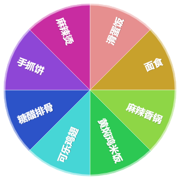

# 更新日志

## v1.0.6 · 2026-10-06

这一版全是拍照识别的坑，都是用户实际踩到之后暴露出来的。

### 修复：换了纯文字模型后，"测试连接"通过但一拍照就报错

报错：`HTTP 400 {"code":"1210","message":"messages.content.type 参数非法，取值范围 ['text']"}`

意思很直白：**这个模型不收图片**，它不是视觉模型。

根因在「测试连接」本身——它只发了一句纯文本（"回复两个字：收到"），
而纯文本模型当然收得下纯文本，所以显示"连接正常"。
可这个接口存在的唯一意义就是「能不能看图」，**我测了个假的**。

改法：

- 「测试连接」现在会**带一张 1×1 的图片**去测（一百来字节，几乎不耗额度）。
  不是视觉模型会当场报错，一眼就知道选错模型了；
- 认出这类报错的指纹（`messages.content.type` / `image_url` / `Expected 'text'` 等），
  翻译成人话：「这个模型不收图片，它不是视觉模型，换成带 V 的」；
- 设置里「模型名」下面加了一条**醒目**的黄色提示（`.warn-hint`）：
  必须是能看图的模型，名字里通常带 `v` / `vl` / `vision`。

### 修复：模型输出被截断时，把一个英文异常直接甩给了用户

报错：`Unterminated string in JSON at position 436 (line 1 column 437)`

这其实**不是错误**——请求成功了，模型也回了内容，只是 JSON 输出到一半
撞上了 `max_tokens`，最后一个菜品对象是残的。而我在 `extractJson` 的最后一步
是裸的 `JSON.parse`，没有兜底，于是 Node 的英文异常就这么漏到界面上了。

改法：

- **先抢救**：扫描出已经完整的那些菜品对象，把残掉的尾巴丢掉，
  重新拼一个合法数组解析出来。截断也能拿到前面认出的菜，不用整个重拍；
- 结果里带 `__salvaged` 标记，界面会如实说「模型输出被截断了，只认出前 N 道」——
  **不能让用户以为菜就这些**；
- 真的一个都救不回来时，抛的是中文说明，绝不泄漏 `JSON.parse` 的英文异常；
- `max_tokens` 从 1200 提到 2000（菜牌上菜多的时候，1200 很容易截断）。

### 新增测试：`scripts/test-vision-errors.mjs`（32 项）

这块之前**完全没有测试**，所以同一个地方连着出了两次错。
现在专门给它写了自测，用真实的服务商错误体作样本：

- 各家错误体里「给人看的那句话」要被抠出来（智谱带 code、OpenAI 带 type、裸 message、非 JSON）
- 429 限流的提示必须把服务商原话放最前面，且**不能出现「发不出去」「跨域」「本地代理」**这些误导词
- 401 / 404 / 5xx 各自的指向正确
- 「连响应都没拿到」时的建议**要分环境**：App 里不能提代理（那儿开关是禁用的）
- 截断的 JSON 能救回已完整的部分、带 `__salvaged` 标记、且不抛英文异常
- 源码层面回归：不再用「消息前缀正则」判断错误类型，`extractJson` 不留裸的 `JSON.parse`

`npm test` 现在会一起跑三套：归类 8 项 + 识别错误 32 项 + 冒烟 48 项。

## v1.0.5 · 2026-10-06

### 修复：App 里勾了「通过本地代理请求」，拍照识别必挂

报错长这样：

```
接口返回的不是 JSON: <!doctype html> <html lang="zh-CN"> <head> <meta charset="utf-8">
<meta name="viewport" content="width=device-width, initial-scale=1, viewport-fit=cover"> <titl…
```

那串 HTML 其实就是**应用自己的首页**。

原因：「通过本地代理请求」是给「浏览器 + `npm run serve`」用的——浏览器有跨域限制，
绕本地服务器转发才没事。但安卓 App 里根本没有那个服务器，WebView 自己跑在
`https://localhost` 上，于是 `/api/vision` 这种相对路径打到了 Capacitor 的静态资源服务器，
被 SPA 兜底规则当成网页返回了。

修法两处：

1. `vision.js` 认得原生壳（`Capacitor.isNativePlatform()`）并**无视这个开关**——
   App 走的是原生网络栈，本来就没有跨域问题；
2. 设置页在 App 里直接**禁用**这个复选框并给出原因，免得再被勾上。
   （原来的判断只覆盖了「本地双击打开的 file://」，而 App 里是 `https://localhost`，漏掉了。）

### 改进：「整体上盘」改成一键可见的按钮

上一版把这个功能放在 ⋯ 菜单里，还要再勾一次大类复选框才上盘——两步，找不到也嫌绕。
现在大类头上有一个一直可见的胶囊按钮：

| 状态 | 样子 | 点一下 |
|---|---|---|
| 未上盘 | 灰色描边 `＋ 整体` | 整个大类**立刻**进转盘，占一个位置 |
| 已上盘 | 绿色实心 `✓ 整体` | 从转盘撤下 |

状态和操作合一，看一眼就知道现在是不是整体，点一下就切过去，不用进菜单。
（⋯ 菜单里也有同样的入口，文案统一成「整个大类加进转盘」。）

### 改进：报错提示不再挡界面、可以点掉

之前那条 JSON 报错是很长一串 HTML，铺在屏幕底部挡住设置项，而且得等 4 秒自己消失。
现在提示框限制了最大高度、可以滚动，**点一下就能关掉**，圆角也不再是诡异的胶囊形。

### 测试

冒烟测试 45 → **48 项**，新增：

- 点一下「整体」按钮就该**一步**上盘（不是先切模式再勾选）
- 未上盘时按钮也在（灰色），状态能看出来
- 原生壳里必须禁用「通过本地代理请求」
- `vision.js` 要认得原生壳并忽略代理

修测试时还发现一处我自己的疏漏：定位按钮时用了「第一个未启用的」，结果点到了别的分组，
把「面食」误设成整体模式——现在按大类名精确定位（`groupElFor` / `oneBtnFor`），
并且每段测试开始前先重置大类的整体状态，避免互相污染。

## v1.0.4 · 2026-10-06

### 新增：大类可以「整体上盘」

以前勾一个大类 = 把下面每道菜都铺到转盘上，各占一个扇区。
菜单一多扇区就挤爆了，而且实际去食堂本来就是**先定吃哪一类、到了窗口再挑具体哪道**。

现在每个大类多了一个模式：

| 模式 | 转盘上长什么样 |
|---|---|
| **按菜品**（默认，和以前一样） | 下面勾中的每道菜各占一个扇区 |
| **整体** | 整个大类只占**一个**扇区，写大类名；下面的菜不再单独出现 |

怎么切：点大类右边的 **⋯** →「改成整个大类上转盘」/「改成按菜品上转盘」。

细节：

- 切成整体的大类，头上会挂一个绿色的 **整体** 标签，一眼能看出哪些类是这样处理；
  它下面的菜品复选框会**置灰不可点**（因为已经不由它们决定转盘了），免得看着能勾却不起作用。
  菜名后面的 **⋯** 菜单照旧可用。
- 整体模式下，大类前面的复选框管的是「**这一类整个上不上盘**」，不再是批量勾选下面每一道。
- 转到一个大类时，结果卡会写成「**这一类里有 N 道，到了窗口再挑一道**」，
  而不是像转到具体某道菜那样只给一个名字。
- 「抽中后自动从转盘移除」「从转盘移除」也分得清：转到大类就撤下这一类，转到菜就撤那道菜。
- **只转这一道**碰上一个整体上盘的大类时会**自动把那个大类切回按菜品**——
  不然这道菜会被大类吃掉，转盘就空了。切换时会明确提示，不会静默改设置。
- 合并两个大类时，如果被并进来的那个是整体模式，目标大类会继承这个设定，不会无声丢掉。

效果（左：8 个扇区里既有大类也有散菜；大类名短，字号自动放大，比一长串菜名清楚得多）：



### 测试

冒烟测试 37 → **45 项**，新增 8 条盯这个功能的：

- 全部撤下后转盘为空
- 整体上盘只占一个扇区、扇区名是大类名
- 整体上盘时**把下面的菜勾上也不展开**
- 界面上出现「整体」标签、菜品复选框被禁用
- 整体模式也能把这一类撤下
- 切回按菜品后恢复成每道一个扇区
- 「只转这一道」遇上整体上盘的大类会切回展开

## v1.0.3 · 2026-10-06

### 修复

- **转完出结果时，结果卡片被下面的面板盖住（按钮只露上半截，点不全）。**
  根因在布局：转盘尺寸是写死的 `min(78vw, 42vh, 420px)`，它不知道结果卡片出现后
  要多占一百多像素。结果卡片一出来，转盘区的内容就比可用高度高出一截，
  溢出的那部分被后面的 `.panel` 压住——面板有自己的背景和 `backdrop-filter`，
  是实打实地盖在上面的。
  实测（手机 CSS 视口约 850px 高）：修复前转盘 306px + 间距 + 结果区 122px = 438px，
  而可用只有 343px，**溢出 95px**，正好是三个按钮被吃掉的那一截。

  改法：转盘尺寸不再写死，改由 `layoutWheel()` 按实际剩余空间算——
  可用高度 = stage 高度 − 结果区高度 − 间距 − 阴影余量，再和宽度、420px 上限取最小。
  结果卡片出现/收起时转盘会自动让位或收回空间。

### 改进

- **转盘缩放带过渡动画**，出结果时是平滑缩小，不再「啪」地跳一下。
- **画布位图按目标尺寸渲染**（新增 `Wheel.resizeTo()`）：
  容器尺寸是渐变的，如果按过渡途中的中间值设位图，字会一阵一阵发糊。
- **结果卡片做得更紧凑**（间距和字号各收一档），少占高度就是给转盘多留空间。
- **结果卡片的进入动画换成从上方轻浮入**（`riseIn`），比原来的缩放更自然，
  也不容易让人误以为「被裁掉一截」。
- **转动时的文字测量加了缓存**：以前每一帧都要对每个扇区做一次二分文本测量，
  扇区多的时候低端机会掉帧——这多半就是「动画不是很顺」的来源。
  现在内容不变时直接复用结果。

### 测试

- 冒烟测试 35 → 37 项。新增两条专门盯这个遮挡问题的回归检查：
  ① 出结果后「转盘 + 间距 + 结果区」的总高必须 ≤ stage 高度；
  ② 出结果后转盘尺寸必须变小（让出空间）。
  为此给 jsdom 补了一套「假的高度模型」（stage 420px、结果区空 28px / 有结果 122px），
  不然这类跟高度有关的 bug 在 jsdom 里根本量不出来。

## v1.0.2 · 2026-10-06

### 修复

- **顶栏被手机状态栏挡住、主题切换按钮点不着。**
  安卓原生壳里 WebView 是 edge-to-edge 的，内容会一直画到状态栏下面，
  而 `env(safe-area-inset-top)` 在不少机型（反馈机型：Redmi K80 至尊版）上返回 0，
  于是顶部那排按钮被状态栏压住。
  修法：原生壳里给安全区一个保底值 `max(env(safe-area-inset-top), 36px)`，
  并且在 `<head>` 里就打好标记，首屏不会看到顶栏往下跳一下。

- **分类（大类）改不了名、也不能自己建。**
  之前改名/删除是两个只有 18×18 像素的小图标（✏️ 🗑），手机上根本点不中——
  这才是「分类名称不能自定义」的真正原因。
  改法：换成 34×34 的 **⋯** 按钮，点开是一列大按钮的菜单
  （重命名 / 往这类里加菜 / 只转这类 / 删除）；每道菜右边的操作也一并换成 **⋯** 菜单。
  另外新增「**＋ 新建大类**」按钮，建完会顺带问一句要不要马上往里加菜；
  菜品编辑里的「归属大类」也多了一项「＋ 新建一个大类…」。

### 新增

- **「✅ 就吃这个」：转完可以直接结束。**
  以前转完只有「再转一次」和「从转盘移除」，想收手只能按返回键。
  现在多了一个明确结束的按钮：定下来之后顶部显示「今天就吃它 🍚」，
  当天再打开也还是这个状态，点「换一个」可以反悔。

## v1.0.1 · 2026-10-06

### 修复

- **修掉「一打开就卡死、点哪儿都没反应」的严重 bug（v1.0.0 的致命问题）。**
  CSS 里 `.modal-mask { display: grid }` 是类选择器，优先级高于浏览器默认样式里的
  `[hidden] { display: none }`（元素选择器），于是弹窗遮罩的 `hidden` 属性**完全失效**——
  一进页面那层模糊遮罩就盖在整个界面上，里面是个还没填内容的空弹窗，
  而且因为此时没有任何弹窗处于打开状态，点遮罩也不会关。
  表现就是：打开 App → 全屏模糊、中间一个空框、点哪儿都没用。

  修了四层（从根上到兜底）：
  1. `[hidden] { display: none !important }` 一条全局兜底规则，一劳永逸；
  2. 遮罩的显示/隐藏改成直接写内联 `style.display`，不再依赖 CSS 优先级；
  3. 自检定时器：遮罩可见但里面没有任何内容 → 自动关掉；
  4. 点击遮罩的**任何**位置（只要不是点弹窗里的按钮/输入框）都能关闭。

- 新增全局错误兜底：任何未捕获的错误或 Promise 异常，都会先把遮罩关掉并弹出提示，
  不再出现「界面无声无息卡死、用户完全不知道发生了什么」的情况。

### 说明

- 这个 bug 之所以能过测试，是因为自动化测试用的是 jsdom，而 jsdom 不做完整的 CSS 层叠
  （两种情况它都返回 `display: none`），复现不了优先级冲突。
  现在补了两条回归检查：① 静态断言那条兜底规则还在；② 真开一次弹窗，确认有内容且点遮罩能关。

## v1.0.0 · 2026-10-05

首个版本。

- 🎡 Canvas 手绘转盘：缓动减速、指针定位、中奖高亮、音效与撒花；字号按扇区弧长和最长菜名自适应
- ✍️ 手动加菜：回车即加、粘贴多行、顿号分隔一行多道、自动去重
- 🗂 大类 / 小项：菜名共同后缀自动成类，大类级三态勾选、只转某一道、重命名 / 合并 / 解散
- 📷 拍照识别：对接任何 OpenAI 兼容视觉接口，拍食堂菜牌自动认菜，可逐条改名校类
- 💾 数据全在本机，支持导出 / 导入 JSON 备份（不含 API Key）
- 📱 单文件网页（双击即用）+ Capacitor 安卓 APK
